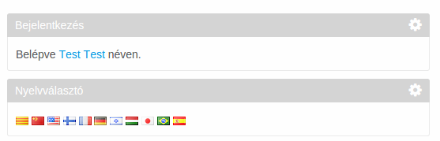
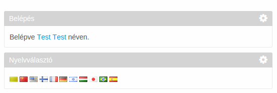

# language hook

Change a language key's value for a particular language, in this case, for Hungarian.
Tipical usage is when you noticed that a translation for you language is not correct for
language key.

Before

Afte

