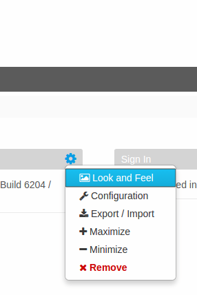
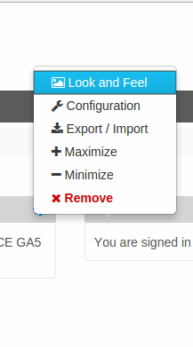

# replace jsp

With liferay-util:buffer you can put a jsp's output (not the jsp itself) into a variable.
Than you can modify the generated html code.
(If you want to manipulate the raw jsp and want to get the output of the compiled/ran modified jsp), it can be more-more-more trickier)

In this example, I changed the "direction-down" class to "direction-up" to extend the menus up not down.

## Before

## After
